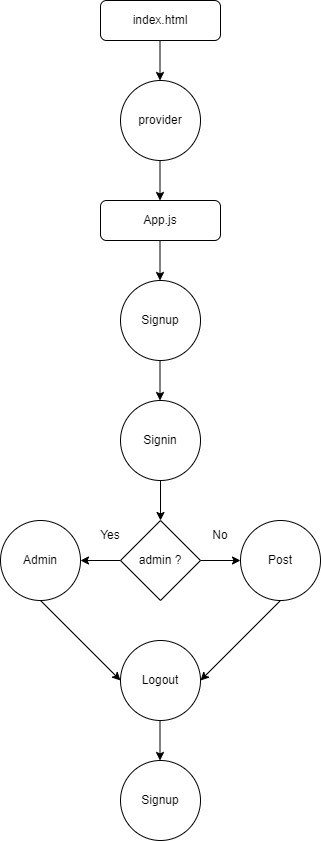

# packeges
- react-redux
- redux
- redux-devtools-extension
- sweetalert2
- react-google-login
- axios
- react-router-dom
- firebase
## installing packges
```
npm i react-redux redux redux-devtools-extension

```

## functions
- login 
here we use google to login 
## UML Digram

